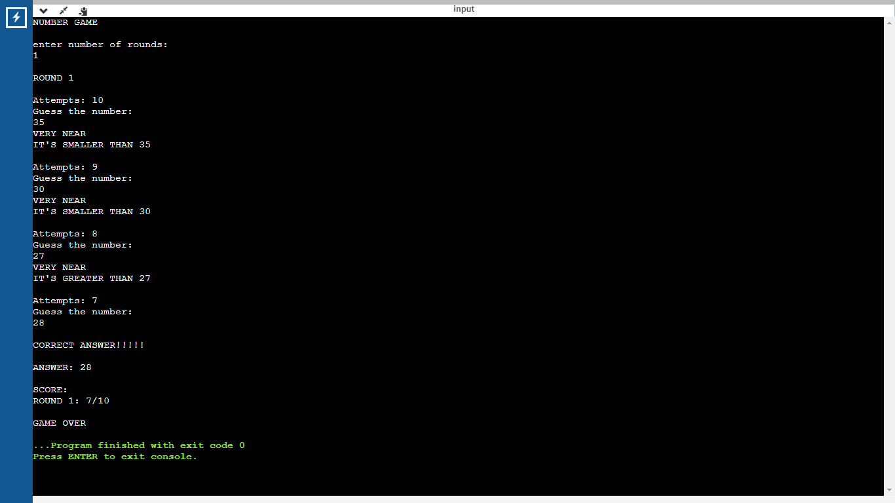
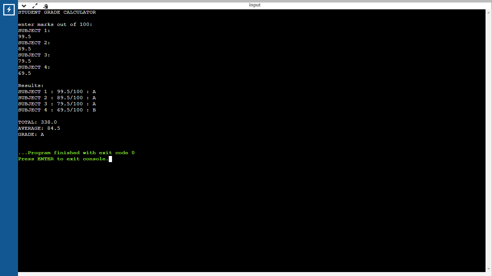
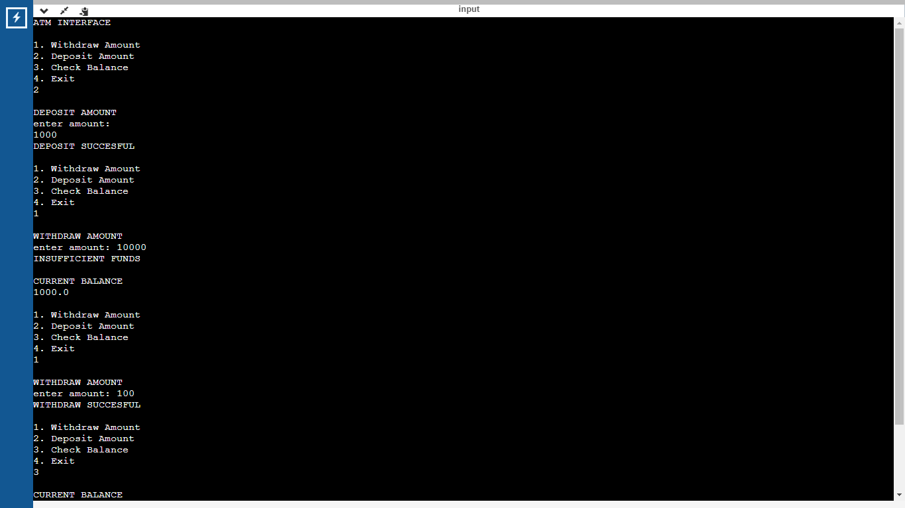
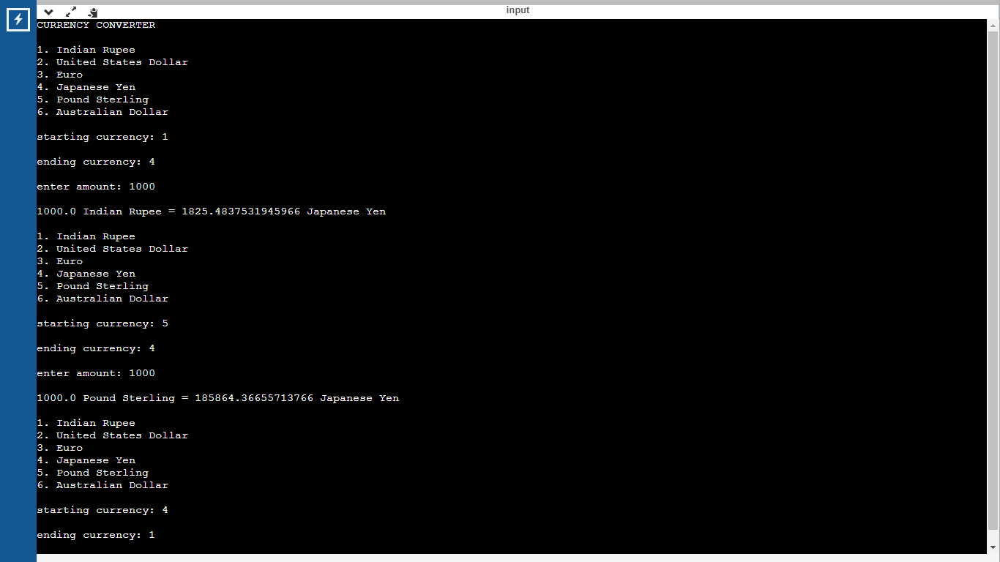
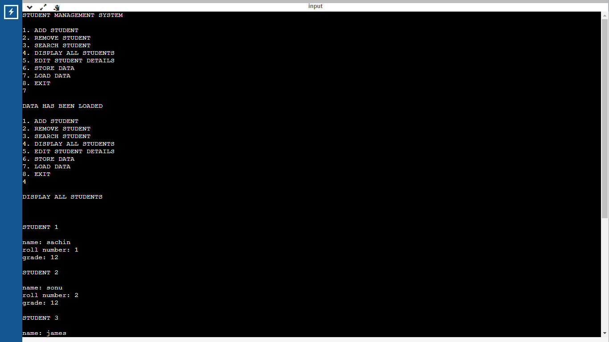

1) Random Number Game: Secretly generates a random number and repeatedly allows the user to guess it until either the guess turns out to be correct or the user runs out of attempts. It allows the user to play multiple rounds and displays the score of each round when the game is over.

2) Student Grade Calculator: Allows the user to input marks in different subjects of the student then calculates the total marks,average marks and grade of the student. To change the number of subjects, subject names, and grading scheme only the global data members need to be edited.

3) ATM Interface: Allows the user to deposit amount, check balance and withdraw amount, if the amount requested to be withdrawn is more than the current balance then an appropriate message is displayed.

4) Currency Converter that allows the interconversion of currencies considering Indian Rupee as base currency.
Currencies supoorted: Indian Rupee (IND), United States Dollar (USD), Euro (EUR), Japanese Yen (JPY), Pound Sterling (GBP), Australian Dollar (AUD). The exchange rates of these currencies with respect to Indian Rupee were taken from Google Finance on 11th November 2023. To update or add exchange rates changes have to be made in the currency class.

5) Student Mangement System: Allows the user to add, remove, search, store, load and display details of the students. It creates and works on a text file named "student.txt" for storing and loading data which is placed at the same path as that of the program file.

